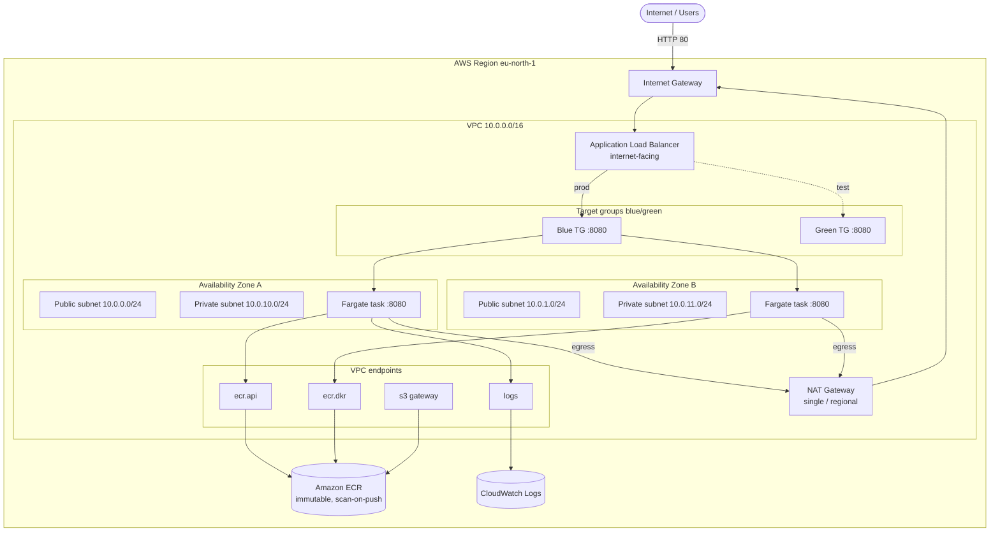
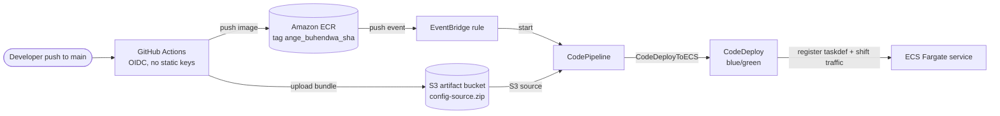

# Architecture — AWS ECS CI/CD Lab

Highly available, containerized Java web app on **Amazon ECS (Fargate)** in a
custom multi-AZ VPC, fronted by a public **Application Load Balancer**, with
**blue/green** deployments driven by image pushes. Infrastructure is provisioned
by **CloudFormation GitSync**; CI authenticates with **GitHub OIDC** (no static
keys). Region: `eu-north-1`.

## 1. Network architecture

**Key points**
- ALB sits in the two **public** subnets; ECS tasks run in the two **private**
  subnets (`AssignPublicIp: DISABLED`) across two AZs for high availability.
- A **single regional NAT Gateway** provides private-subnet egress (cost
  optimization vs. one-per-AZ).
- Image pulls and logging traverse **VPC endpoints** (`ecr.api`, `ecr.dkr`,
  `logs` interface endpoints + `s3` gateway endpoint) — tasks reach ECR and
  CloudWatch privately.
- Two target groups (**blue/green**) let CodeDeploy shift traffic between the
  running and the new task set.

## 2. Security groups (least privilege)

- **ALB SG** — inbound `80` from the internet.
- **Task SG** — inbound app port `8080` only from the ALB SG.
- **VPC Endpoint SG** — inbound `443` only from the Task SG.

## 3. CI/CD and deployment pipeline

**Flow**
1. Push to `main` → GitHub Actions assumes an IAM role via **OIDC** and builds the image.
2. Image is tagged **`ange_buhendwa_<commit-sha>`** (consistent, immutable) and
   pushed to ECR; the deploy bundle (`taskdef.json` + `appspec.yaml`, with the
   exact image URI baked in) is uploaded to S3.
3. The ECR push emits an **EventBridge** event that starts **CodePipeline**.
4. CodePipeline runs **CodeDeploy (blue/green)**: registers a new task
   definition, launches a green task set, health-checks it, shifts ALB traffic
   blue → green, then terminates blue.

## 4. Application auto scaling

- ECS service: **min 1 / desired 1 / max 4** tasks.
- Target-tracking on **average CPU = 50%** (`ECSServiceAverageCPUUtilization`).

## 5. Components

| Layer | Resources |
|-------|-----------|
| Network | VPC, 2 public + 2 private subnets, IGW, single NAT GW, route tables |
| Connectivity | VPC endpoints: `ecr.api`, `ecr.dkr`, `logs` (interface) + `s3` (gateway) |
| Compute | ECS cluster, Fargate task definition, service (CODE_DEPLOY controller) |
| Edge | ALB, prod listener `:80`, test listener `:8080`, blue + green target groups |
| Images | ECR repo (immutable tags, scan-on-push, lifecycle: keep last 10) |
| CI | GitHub Actions + IAM OIDC provider/role (ECR push, S3 upload) |
| CD | EventBridge rule, CodePipeline, CodeDeploy app + deployment group, S3 artifacts |
| Observability | CloudWatch Logs (`/ecs/ecs-cicd`), Container Insights |
| Scaling | Application Auto Scaling target + CPU target-tracking policy |

> All resources are provisioned via **CloudFormation GitSync** from this
> `infrastructure` branch (`template.yaml` + `deployment-config.json`). The
> application code, `Dockerfile`, and GitHub Actions workflow live on `main`.
