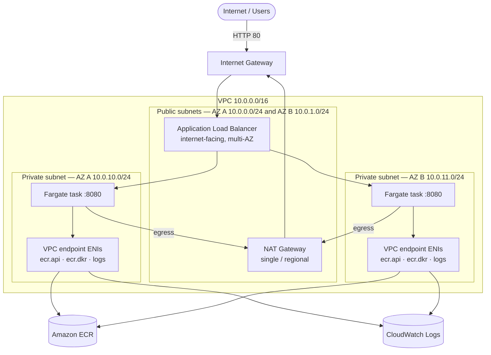
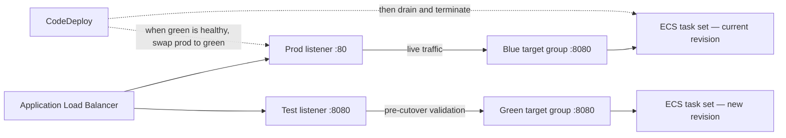

# Architecture — AWS ECS CI/CD Lab

Highly available, containerized Java web app on **Amazon ECS (Fargate)** in a
custom multi-AZ VPC, fronted by a public **Application Load Balancer**, with
**blue/green** deployments driven by image pushes. Infrastructure is provisioned
by **CloudFormation GitSync**; CI authenticates with **GitHub OIDC** (no static
keys). Region: `eu-north-1`.

## 1. Network architecture

Tasks run **inside the private subnets**; the ALB and NAT Gateway live in the
public subnets.

- ECS tasks sit in the two **private** subnets (`AssignPublicIp: DISABLED`),
  one per AZ for high availability.
- ALB + a **single regional NAT Gateway** sit in the **public** subnets (the NAT
  is physically in AZ A's public subnet and shared by both private subnets).
- Image pulls / logging go through **VPC endpoints** whose ENIs live in the
  private subnets — tasks reach ECR and CloudWatch privately. (An `s3` gateway
  endpoint, attached to the private route table, backs ECR layer downloads.)

## 2. Blue/green traffic routing

The ALB has **two listeners** and **two target groups**. "Blue" and "Green" are
just the two interchangeable slots — at any time one holds the live task set and
the other is free for the next release.

During a deploy CodeDeploy launches the new revision into the **idle** target
group (green here), validates it via the test listener + ALB health checks, then
**repoints the production listener** from blue → green. The old task set is
drained and terminated after a wait. The next deploy reverses the roles.

## 3. Security groups (least privilege)

- **ALB SG** — inbound `80` from the internet.
- **Task SG** — inbound app port `8080` only from the ALB SG.
- **VPC Endpoint SG** — inbound `443` only from the Task SG.

## 4. CI/CD and deployment pipeline

1. Push to `main` → GitHub Actions assumes an IAM role via **OIDC** and builds the image.
2. Image is tagged **`ange_buhendwa_<commit-sha>`** (consistent, immutable) and
   pushed to ECR; the deploy bundle (`taskdef.json` + `appspec.yaml`, image URI
   baked in) is uploaded to S3.
3. The ECR push emits an **EventBridge** event that starts **CodePipeline**.
4. CodePipeline runs **CodeDeploy (blue/green)** — see section 2.

## 5. Application auto scaling

- ECS service: **min 1 / desired 1 / max 4** tasks.
- Target-tracking on **average CPU = 50%** (`ECSServiceAverageCPUUtilization`).

## 6. Components

| Layer | Resources |
|-------|-----------|
| Network | VPC, 2 public + 2 private subnets, IGW, single NAT GW, route tables |
| Connectivity | VPC endpoints: `ecr.api`, `ecr.dkr`, `logs` (interface) + `s3` (gateway) |
| Compute | ECS cluster, Fargate task definition, service (CODE_DEPLOY controller) |
| Edge | ALB, prod listener `:80`, test listener `:8080`, blue + green target groups |
| Images | ECR repo (immutable tags, scan-on-push, lifecycle: keep last 10) |
| CI | GitHub Actions + IAM OIDC provider/role (ECR push, S3 upload) |
| CD | EventBridge rule, CodePipeline, CodeDeploy app + deployment group, S3 artifacts |
| Observability | CloudWatch Logs (`/ecs/ecs-cicd`), Container Insights |
| Scaling | Application Auto Scaling target + CPU target-tracking policy |

> Provisioned via **CloudFormation GitSync** from this `infrastructure` branch
> (`template.yaml` + `deployment-config.json`). The application code,
> `Dockerfile`, and GitHub Actions workflow live on `main`.
