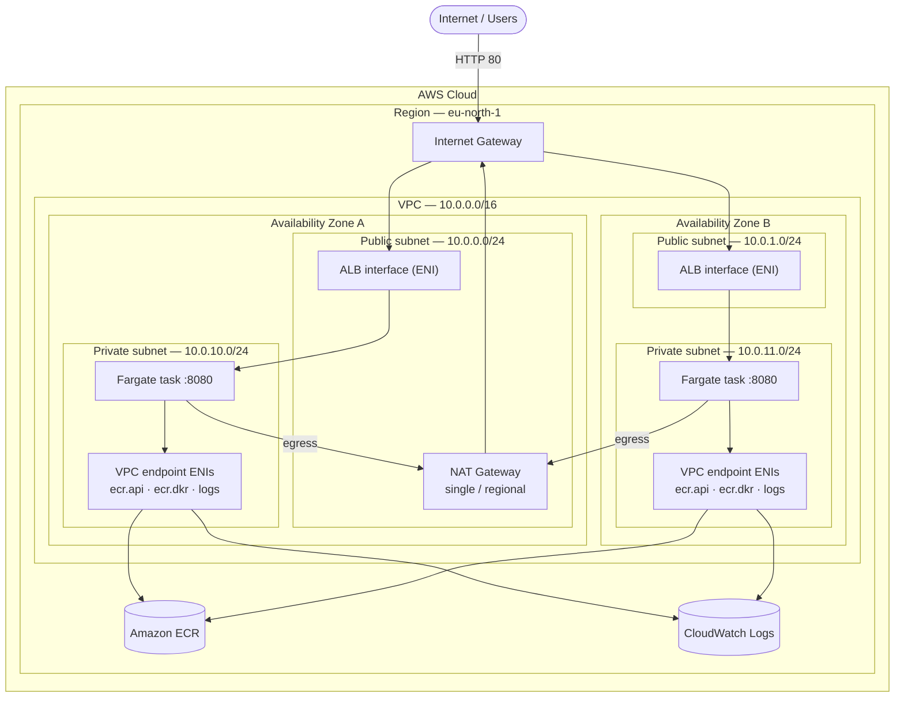
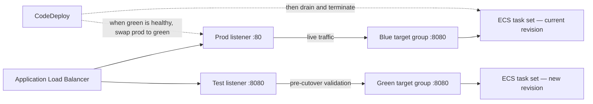
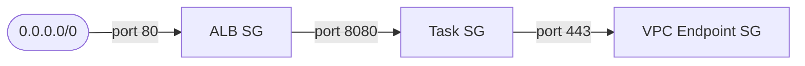

# Architecture — AWS ECS CI/CD Lab

Highly available, containerized Java web app on **Amazon ECS (Fargate)** in a
custom multi-AZ VPC, fronted by a public **Application Load Balancer**, with
**blue/green** deployments driven by image pushes. Infrastructure is provisioned
by **CloudFormation GitSync**; CI authenticates with **GitHub OIDC** (no static
keys). Region: `eu-north-1`.

## 1. Network architecture

Tasks run **inside the private subnets**; the ALB and NAT Gateway live in the
public subnets.

- Hierarchy: **AWS Cloud → Region → VPC → AZ → subnet → resource.** Two AZs,
  each with a **public** and a **private** subnet.
- ECS tasks sit in the two **private** subnets (`AssignPublicIp: DISABLED`),
  one per AZ for high availability.
- The **ALB** is a single internet-facing load balancer with an interface
  (`albA` / `albB`) in each public subnet. Cross-zone load balancing spreads
  requests to tasks in both AZs. Its **listeners** (`prod :80`, `test :8080`)
  and target-group routing are shown in
  [section 2](#2-bluegreen-traffic-routing).
- The **Internet Gateway is just the VPC's internet door** — it does *not* route
  or load-balance. Route tables send public-subnet traffic to it; **DNS** picks
  which ALB interface a client hits; the **listeners/ALB** pick the backend task.
  The arrows `igw → albA/albB` only mean "inbound traffic enters via the IGW."
- A **single regional NAT Gateway** (one NAT shared by the whole VPC, per the
  requirement — not one per AZ) sits in AZ A's public subnet and serves both
  private subnets. This is the deliberate cost-vs-HA tradeoff.
- Image pulls / logging go through **VPC endpoints** whose ENIs live in the
  private subnets — tasks reach ECR and CloudWatch privately. (An `s3` gateway
  endpoint, attached to the private route table, backs ECR layer downloads.)

> **Why public subnets at all, if the tasks are private?** Two things must be
> public-facing and both live there: the **internet-facing ALB** (it can only be
> placed in IGW-routed subnets to receive inbound traffic) and the **NAT
> Gateway** (it needs an Elastic IP + IGW route to give the private subnets
> outbound internet). The workload tasks never sit in the public subnets.

## 2. Blue/green traffic routing

The ALB has **two listeners** and **two target groups**. "Blue" and "Green" are
just the two interchangeable slots — at any time one holds the live task set and
the other is free for the next release.

During a deploy CodeDeploy launches the new revision into the **idle** target
group (green here), validates it via the test listener + ALB health checks, then
**repoints the production listener** from blue → green. The old task set is
drained and terminated after a wait. The next deploy reverses the roles.

### How tasks start and terminate (per deploy)

Fargate has **no EC2 instances** — CodeDeploy manipulates ECS **task sets** and
the ALB's **listener-to-target-group** mapping (the ALB DNS name never changes):

1. **Steady state** — the *blue* task set (current revision, desired-count
   tasks) is registered in the blue target group; the prod listener `:80`
   forwards there, so blue serves live traffic.
2. **New deploy** — CodeDeploy registers the new task definition and launches a
   *green* task set: brand-new Fargate tasks in the private subnets, registered
   (by ENI IP) into the green target group.
3. **Health gate** — the ALB health-checks the green targets on `/`; CodeDeploy
   waits until green is healthy (it does **not** touch blue yet, so there is no
   downtime or capacity dip).
4. **Cutover** — CodeDeploy reroutes the **prod listener `:80` from the blue TG
   to the green TG** (all-at-once here). Live traffic now hits green.
5. **Bake window** — it then waits `TerminationWaitTimeInMinutes` (**5 min**)
   with blue still running, so a rollback is instant (just point `:80` back to
   blue).
6. **Terminate old** — after the wait, the **blue task set is drained**
   (30 s deregistration delay lets in-flight requests finish) and its tasks are
   **terminated**. Green is now the live set; roles swap on the next deploy.
7. **Rollback** — if green never becomes healthy (or a rollback is triggered),
   the prod listener stays on blue and the **green tasks are terminated** — the
   live set is never affected.

Note: the desired/min/max task counts (auto scaling, 1–4) apply to whichever
task set is live; CodeDeploy launches the green set at the same desired count.

## 3. Security groups (least privilege)

- **ALB SG** — inbound `80` from the internet.
- **Task SG** — inbound app port `8080` only from the ALB SG.
- **VPC Endpoint SG** — inbound `443` only from the Task SG.

## 4. CI/CD and deployment pipeline

1. Push to `main` → GitHub Actions assumes an IAM role via **OIDC** and builds the image.
2. Image is tagged **`ange_buhendwa_<commit-sha>`** (consistent, immutable) and
   pushed to ECR; the deploy bundle (`taskdef.json` + `appspec.yaml`, image URI
   baked in) is uploaded to S3.
3. The ECR push emits an **EventBridge** event that starts **CodePipeline**.
4. CodePipeline runs **CodeDeploy (blue/green)** — see section 2.

## 5. Application auto scaling

- ECS service: **min 1 / desired 1 / max 4** tasks.
- Target-tracking on **average CPU = 50%** (`ECSServiceAverageCPUUtilization`).

## 6. Components

| Layer | Resources |
|-------|-----------|
| Network | VPC, 2 public + 2 private subnets, IGW, single NAT GW, route tables |
| Connectivity | VPC endpoints: `ecr.api`, `ecr.dkr`, `logs` (interface) + `s3` (gateway) |
| Compute | ECS cluster, Fargate task definition, service (CODE_DEPLOY controller) |
| Edge | ALB, prod listener `:80`, test listener `:8080`, blue + green target groups |
| Images | ECR repo (immutable tags, scan-on-push, lifecycle: keep last 10) |
| CI | GitHub Actions + IAM OIDC provider/role (ECR push, S3 upload) |
| CD | EventBridge rule, CodePipeline, CodeDeploy app + deployment group, S3 artifacts |
| Observability | CloudWatch Logs (`/ecs/ecs-cicd`), Container Insights |
| Scaling | Application Auto Scaling target + CPU target-tracking policy |

> Provisioned via **CloudFormation GitSync** from this `infrastructure` branch
> (`template.yaml` + `deployment-config.json`). The application code,
> `Dockerfile`, and GitHub Actions workflow live on `main`.
